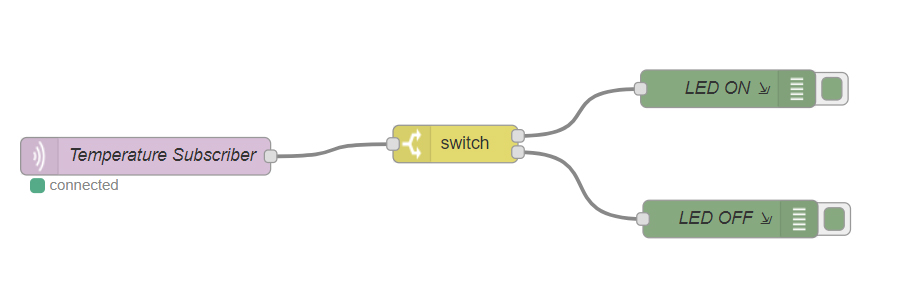

# Lab Outline 4
##### 11. October 2017
with Magdalena Hametner and Eva Jobst

##### Node-RED

| Exercise                | Done By           |
|----------               |-------------      |
| Code                    | Jobst             |
| Documentation           | Jobst             |

- Trying to get Node-RED to work
  - Node-RED was not recognized on cmd -> Installed it again
  - Installed it -> was recognized
  - Trying to access it on browser -> worked
- Trying to build a flow, which receives the MQTT messages of the Temperature Simulation and sends a Debug Message if the LED should be turned on or off. LED is turned on, once the Temperature is over 0°C.

- Adapt existing flow, so it replaces the [client.py](Lab_Outline/Temperature_Simulation/client.py)

